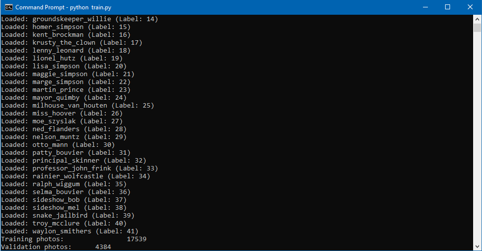
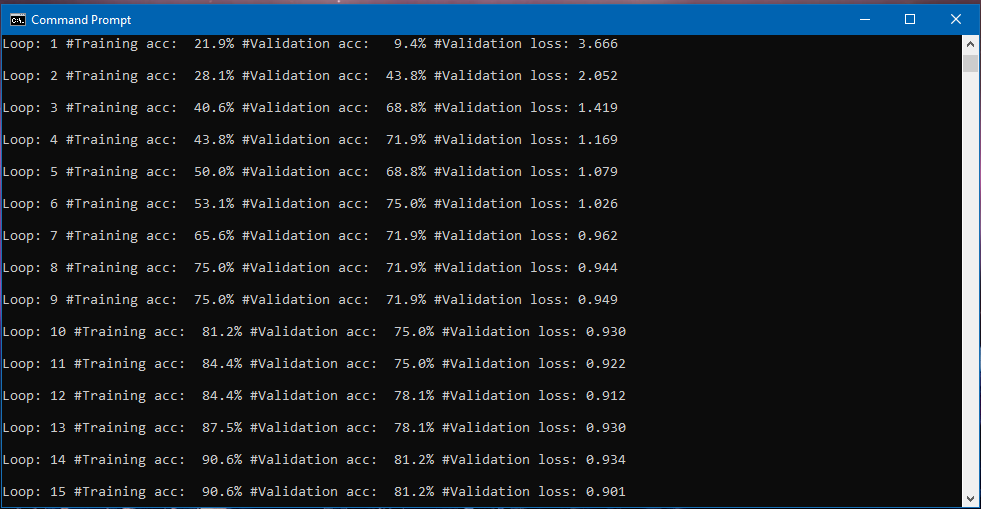
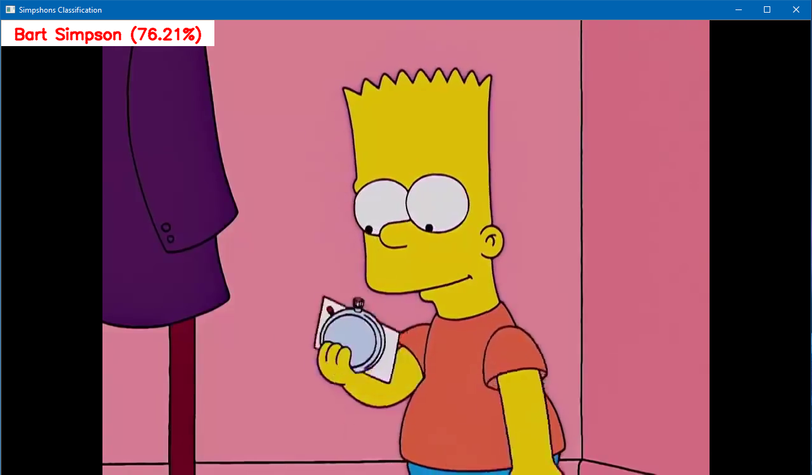
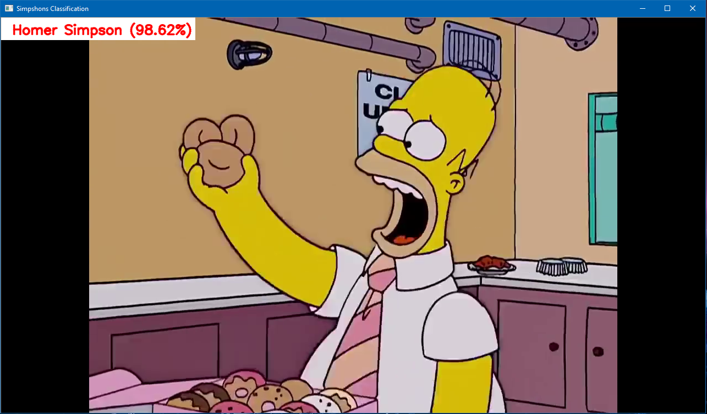

**Idea projektu zrodziła się po odnalezieniu bazy danych zdjęć Simpsonów na kaggle.com. Celem projektu było wyuczenie sieci neuronowej rozpoznawania bohaterów serialu podczas odtwarzania wideo. Do stworzenia sieci neuronowej postanowiłem wykorzystać framework TensorFlow.**

##### Linki:
* [[0] Baza plików ze zdjęciami](https://www.kaggle.com/alexattia/the-simpsons-characters-dataset)
* [[1] Źródło, na którym bazowałem sieć neuronową](http://cv-tricks.com/tensorflow-tutorial/training-convolutional-neural-network-for-image-classification/)
* [[2] Kurs i dokumentacja OpenCV-Python](https://docs.opencv.org/3.0-beta/doc/py_tutorials/py_tutorials.html)
* [[3] Przykładowy fragment serialu Simpsons](https://www.youtube.com/watch?v=i6sTatKAXt0)

##### Wersje użytych technologii:
* Python 3.6.4
* Tensorflow 1.7
* OpenCV 3.4

##### Schemat projetu:
```
-Simpsons_Serial_Classification
  -data
    -train
      -abraham_grampa_simpson
        -pic_0000.jpg
        -...
        -pic_0912.jpg
      -...
      -waylon_smithers
    -simpsons.mp4
  -model
    -checkpoint
    -simpsons_model.data-00000-of-00001
    -simpsons_model.index
    -simpsons_model.meta
  -dataset.py
  -player.py
  -train.py
```

##### Konwolucyjna sieci neuronowej
Opierając się na gotowej budowie sieci neuronowej[2], dostosowałem ją do potrzeb tego projektu. Sieć składa się z 3 warstw splotowych (wczytujących dane i tworzącą kompletną warstwę splotu), warstwy spłaszczającej (łączy 3 warstwy splotu w 1) oraz z w pełni połączonej warstwy danych (wykonujemy na niej operację `dane_wyjściowe = wagi*dane_wejściowe + tendencyjność`. Parametry poszczególnych warstw pozostawiłem bez zmian.


Infografika przedstawiająca 20 postaci z serialu:


Wczytywanie danych do programu treningowego za pomocą `dataset.py`:


Trenowanie sieci neuronowej z wykorzystaniem `train.py`. Najlpeszy rezultat dokładności dane treningowe : dane walidacyjne otrzymałem dla 15 powtórzeń algorytmu:


Przykładowe kadry z odtwarzanego fragmentu serialu[4] odtwarzanego za pomocą `player.py`:

Dopasowanie: Bart Simpson | Dopasowanie: Homer Simson
------------ | -------------
 | 

**Rozpoznawanie postaci w odtwarzanym wideo działa bardzo dobrze w przypadku jednej postaci w kadrze. W przypadku wielu postaci dopasowanie jest prawidłowe dla jednej z postaci lub błędne. Próbowałem wyróżniać konkretnych bohaterów w kadrze, jednak żaden z algorytmów nie pozwalał na wystarczające ich wyodrębnienie.**
